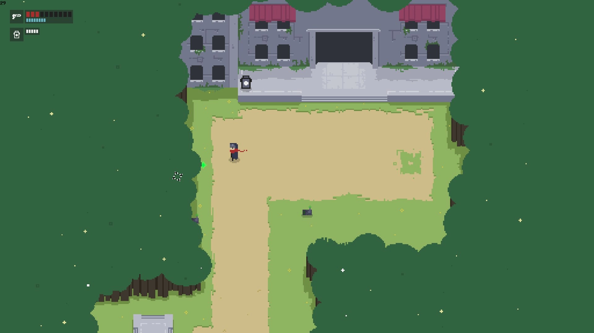
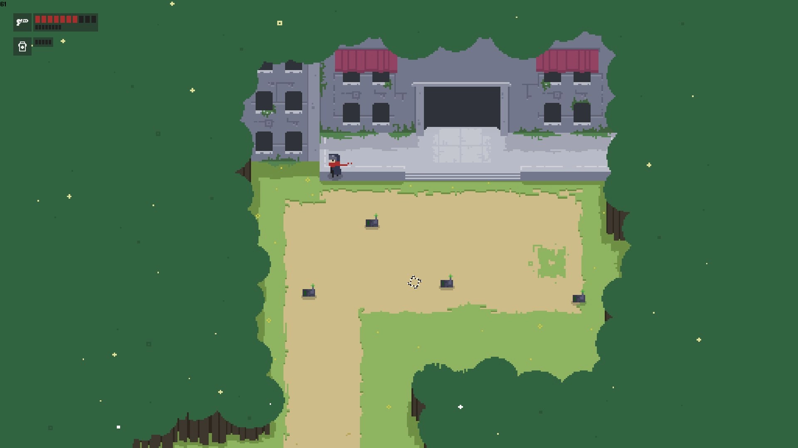
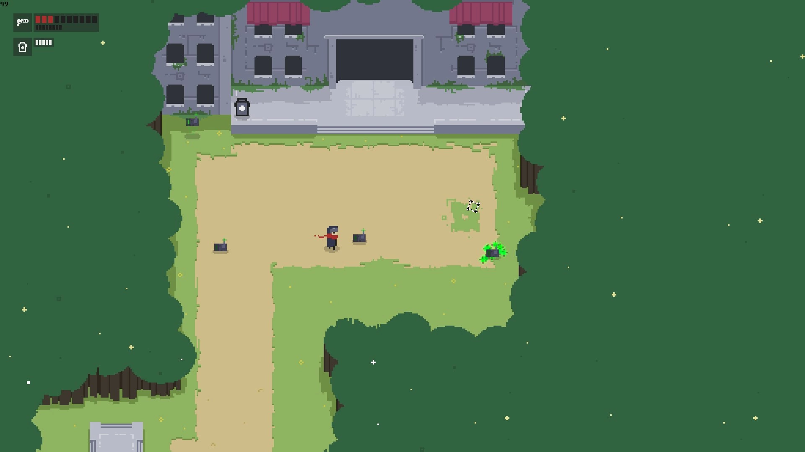
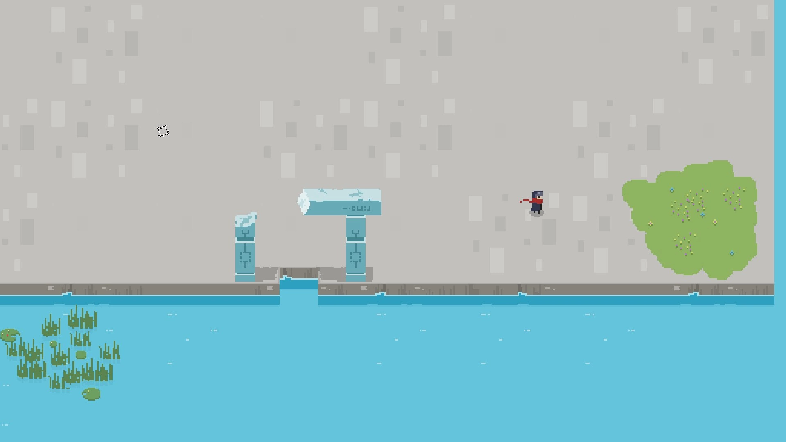
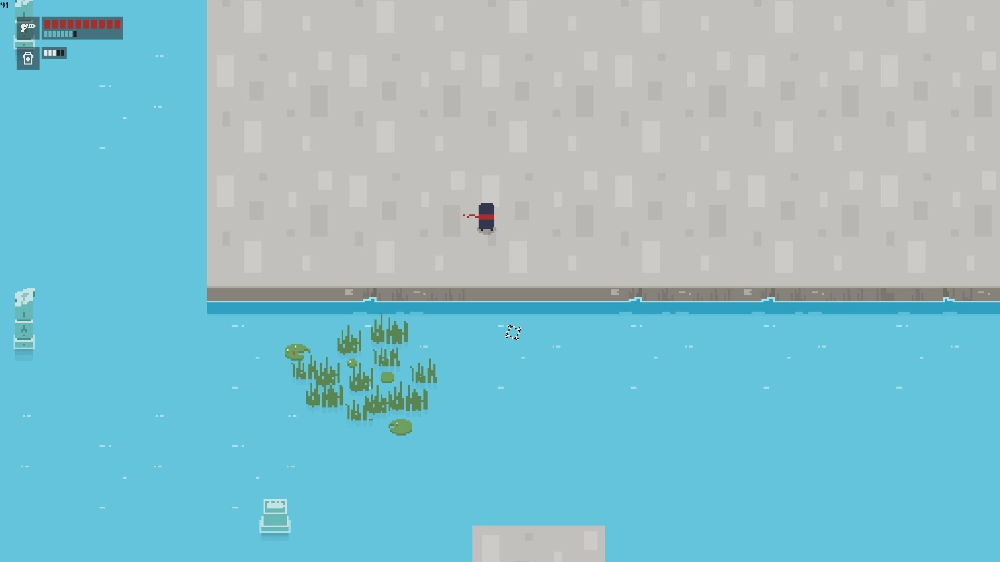

# RGame

This work is licensed under a <a rel="license" href="http://creativecommons.org/licenses/by-nc-nd/4.0/">Creative Commons Attribution-NonCommercial-NoDerivatives 4.0 International License (CC-BY-NC-ND)</a>.
________________

**Engine - Game Maker: Studio 1**

**Language - Game Maker Language**

**Source Code - Available: Latest version**

**Executables - Lost**

**Development Date - 2016 or 2017**

________________

## Description
RGame stands for random game and that was basically it. Was contacted by an artist who pitched me a game similar to Hyper Light Drifter, it wasn't really anything and in the end this game ended up in a backshelf.

## Screenshots
Starting area

  

Rain and wondering bots (in latest version rain damaged them)

Shore mockup

 
